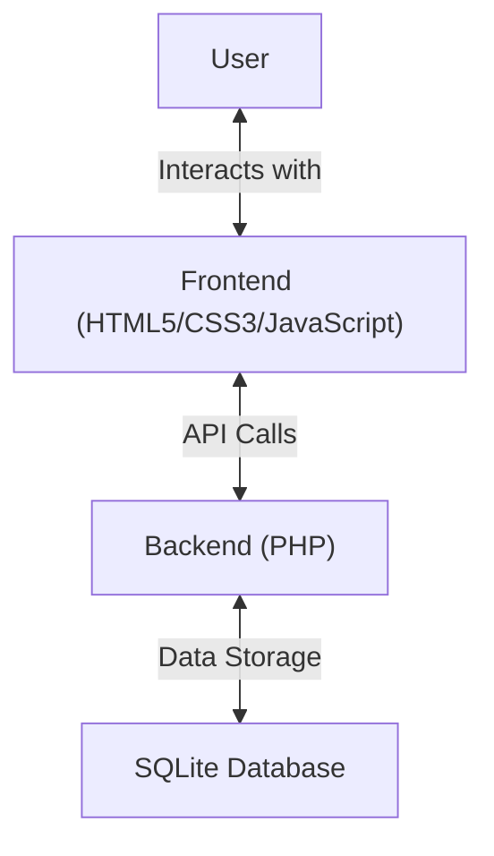

# Tendercare Healthcare Solutions

A modern healthcare technology platform designed to transform medical practices with intelligent solutions.

## 🌟 Features

- **Responsive Design**: Fully responsive layout that works on all devices
- **Modern UI/UX**: Clean, intuitive interface with smooth animations
- **Contact Forms**: Secure contact forms with validation
- **Interactive Elements**: Animated components and interactive sections
- **Google Maps Integration**: Easy location finding with embedded Google Maps
- **Testimonials**: Client testimonials with image carousel
- **Team Section**: Showcase your leadership team

## 🛠️ Tech Stack



### Frontend
- HTML5, CSS3, JavaScript (ES6+)
- Bootstrap 5 for responsive layout
- Swiper.js for carousels and sliders
- AOS (Animate On Scroll) for scroll animations
- Google Fonts (Nunito, Roboto, Inter)

### Backend
- PHP 7.4+
- PHPMailer for email functionality
- SQLite for data storage
- CSRF protection and input sanitization

## 🚀 Local Development Setup

### 🛠 Prerequisites

Before you begin, ensure you have the following installed on your system:

1. **Web Server Software** (Choose one):
   - [XAMPP](https://www.apachefriends.org/) (Windows/macOS/Linux)
   - [MAMP](https://www.mamp.info/) (macOS/Windows)
   - [WAMP](https://www.wampserver.com/) (Windows)
   - [Laragon](https://laragon.org/) (Windows)

2. **PHP 7.4 or higher**
   - Included in XAMPP/MAMP/WAMP
   - Or install separately: [PHP Downloads](https://windows.php.net/download/)

3. **Composer** (PHP package manager)
   - [Download Composer](https://getcomposer.org/download/)

4. **Text Editor** (Recommended):
   - [VS Code](https://code.visualstudio.com/)
   - [Sublime Text](https://www.sublimetext.com/)
   - [PHPStorm](https://www.jetbrains.com/phpstorm/)

### 🔧 Installation Steps

#### Method 1: Using XAMPP (Recommended for Beginners)

1. **Install XAMPP**
   - Download from [XAMPP official website](https://www.apachefriends.org/)
   - Run the installer with default settings
   - Start Apache and MySQL services from the XAMPP Control Panel

2. **Extract the Project**
   - Extract the downloaded ZIP file to: `C:\xampp\htdocs\Tendercare` (Windows) or `/Applications/XAMPP/htdocs/Tendercare` (macOS)

3. **Install Dependencies**
   - Open Command Prompt/Terminal
   - Navigate to the project directory
   - Run: `composer install`

4. **Configure PHP Mail (Optional)**
   - Open `php.ini` in your XAMPP PHP directory
   - Find `[mail function]` and configure SMTP settings
   - Or use a service like [Mailtrap](https://mailtrap.io/) for testing

5. **Start the Development Server**
   - Open browser and go to: `http://localhost/Tendercare`

#### Method 2: Using Built-in PHP Server (For Quick Testing)

1. **Extract the ZIP file** to your preferred directory

2. **Open Terminal/Command Prompt**
   - Navigate to the project directory
   - Run: `composer install`
   - Then run: `php -S localhost:8000`

3. **Access the website** at: `http://localhost:8000`

### ⚙️ Configuration

1. **Email Settings**
   - Open `forms/contact.php`
   - Update the SMTP settings with your email configuration
   - For testing, you can use Mailtrap

2. **Google Maps API**
   - Get an API key from [Google Cloud Console](https://console.cloud.google.com/)
   - Replace `YOUR_GOOGLE_MAPS_API_KEY` in relevant files

### 🐛 Troubleshooting

1. **PHP Not Found**
   - Ensure PHP is added to your system PATH
   - Restart your terminal after installation

2. **Composer Not Found**
   - Reinstall Composer and check "Add to PATH" during installation

3. **Email Not Sending**
   - Check SMTP settings in `contact.php`
   - Ensure your local server can send emails or use Mailtrap

4. **Page Not Loading**
   - Make sure your web server is running
   - Check for any PHP errors in the server logs

## 📂 Project Structure

```
Tendercare-website/
├── assets/
│   ├── css/           # Stylesheets
│   ├── img/           # Images and icons
│   ├── js/            # JavaScript files
│   └── vendor/        # Third-party libraries
├── forms/             # PHP form handlers
├── includes/          # PHP includes
├── index.html         # Homepage
├── about.html         # About/Team page
├── faq.html           # FAQ page
└── demo-form.php      # Demo request form
```

## 🎨 Design System

### Colors
- Primary: `#ff6600` (Orange)
- Secondary: `#14213d` (Dark Blue)
- Background: `#ffffff` (White)
- Text: `#212529` (Dark Gray)
- Accent: `#ffb347` (Light Orange)

### Typography
- **Headings**: Nunito (700)
- **Body Text**: Roboto (400, 500)
- **Navigation**: Inter (500)

## 🤝 Contributing

1. Fork the project
2. Create your feature branch (`git checkout -b feature/AmazingFeature`)
3. Commit your changes (`git commit -m 'Add some AmazingFeature'`)
4. Push to the branch (`git push origin feature/AmazingFeature`)
5. Open a Pull Request

## 📄 License

This project is licensed under the MIT License - see the [LICENSE](LICENSE) file for details.

## 👤 Author

**Manav Arya Singh**
- GitHub: [@Manavarya09](https://github.com/Manavarya09)

## 🙏 Acknowledgments

- [Bootstrap](https://getbootstrap.com/)
- [Swiper](https://swiperjs.com/)
- [AOS](https://michalsnik.github.io/aos/)
- [Google Fonts](https://fonts.google.com/)
- [Font Awesome](https://fontawesome.com/)
