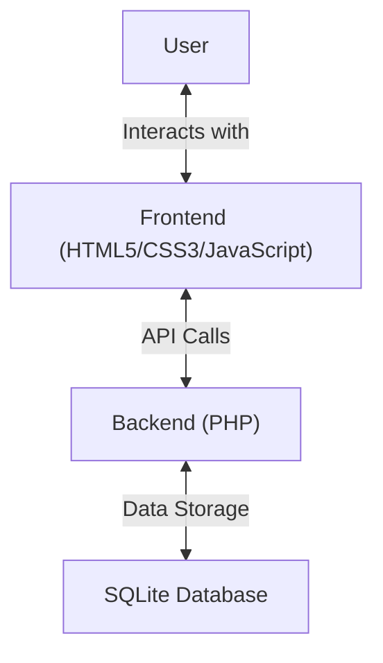

# Tendercare Healthcare Solutions

A modern healthcare technology platform designed to transform medical practices with intelligent solutions.

## 🌟 Features

- **Responsive Design**: Fully responsive layout that works on all devices
- **Modern UI/UX**: Clean, intuitive interface with smooth animations
- **Contact Forms**: Secure contact forms with validation
- **Interactive Elements**: Animated components and interactive sections
- **Google Maps Integration**: Easy location finding with embedded Google Maps
- **Testimonials**: Client testimonials with image carousel
- **Team Section**: Showcase your leadership team

## 🛠️ Tech Stack



### Frontend
- HTML5, CSS3, JavaScript (ES6+)
- Bootstrap 5 for responsive layout
- Swiper.js for carousels and sliders
- AOS (Animate On Scroll) for scroll animations
- Google Fonts (Nunito, Roboto, Inter)

### Backend
- PHP 7.4+
- PHPMailer for email functionality
- SQLite for data storage
- CSRF protection and input sanitization

## 🚀 Getting Started

### Prerequisites
- PHP 7.4 or higher
- Web server (Apache/Nginx)
- Composer (for PHP dependencies)

### Installation
1. Clone the repository:
   ```bash
   git clone https://github.com/Manavarya09/Tendercare-website.git
   cd Tendercare-website
   ```

2. Install PHP dependencies:
   ```bash
   composer install
   ```

3. Configure your web server to point to the project directory

4. Update the following files with your configuration:
   - `forms/contact.php` - Update email settings
   - Update Google Maps API key in relevant files

## 📂 Project Structure

```
Tendercare-website/
├── assets/
│   ├── css/           # Stylesheets
│   ├── img/           # Images and icons
│   ├── js/            # JavaScript files
│   └── vendor/        # Third-party libraries
├── forms/             # PHP form handlers
├── includes/          # PHP includes
├── index.html         # Homepage
├── about.html         # About/Team page
├── faq.html           # FAQ page
└── demo-form.php      # Demo request form
```

## 🎨 Design System

### Colors
- Primary: `#ff6600` (Orange)
- Secondary: `#14213d` (Dark Blue)
- Background: `#ffffff` (White)
- Text: `#212529` (Dark Gray)
- Accent: `#ffb347` (Light Orange)

### Typography
- **Headings**: Nunito (700)
- **Body Text**: Roboto (400, 500)
- **Navigation**: Inter (500)

## 🤝 Contributing

1. Fork the project
2. Create your feature branch (`git checkout -b feature/AmazingFeature`)
3. Commit your changes (`git commit -m 'Add some AmazingFeature'`)
4. Push to the branch (`git push origin feature/AmazingFeature`)
5. Open a Pull Request

## 📄 License

This project is licensed under the MIT License - see the [LICENSE](LICENSE) file for details.

## 👤 Author

**Manav Arya Singh**
- GitHub: [@Manavarya09](https://github.com/Manavarya09)

## 🙏 Acknowledgments

- [Bootstrap](https://getbootstrap.com/)
- [Swiper](https://swiperjs.com/)
- [AOS](https://michalsnik.github.io/aos/)
- [Google Fonts](https://fonts.google.com/)
- [Font Awesome](https://fontawesome.com/)
