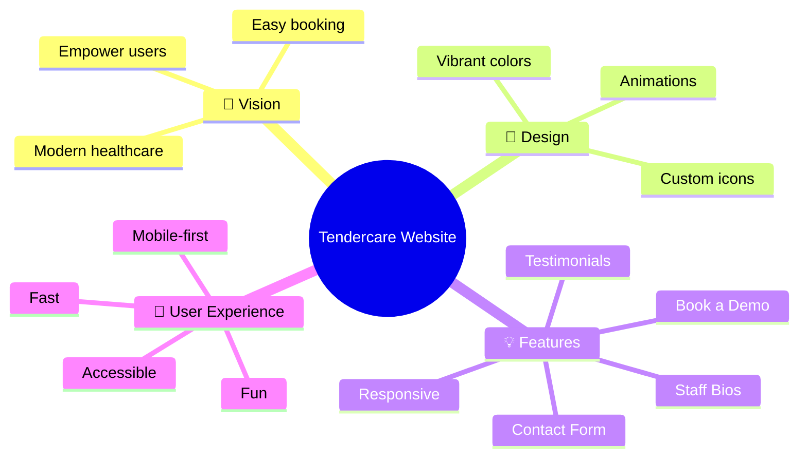
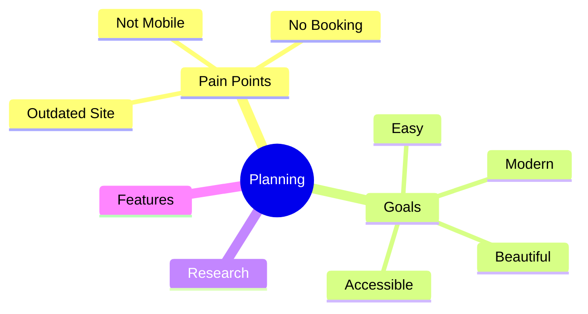
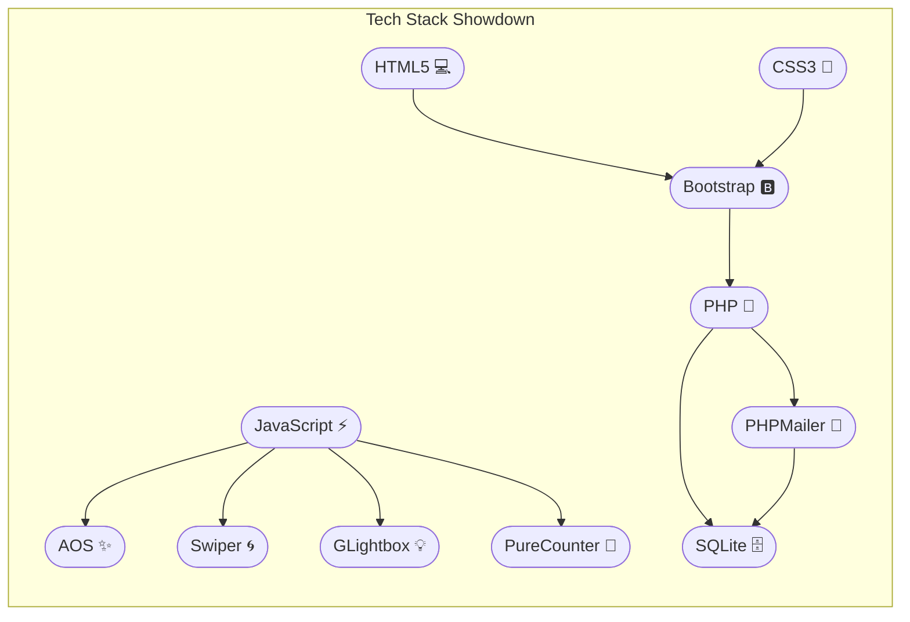
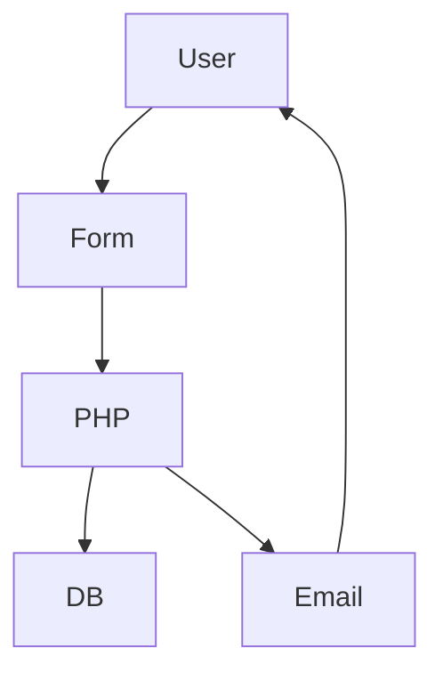
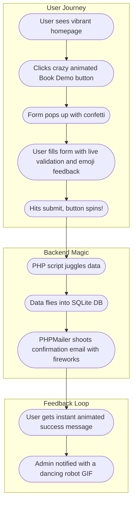
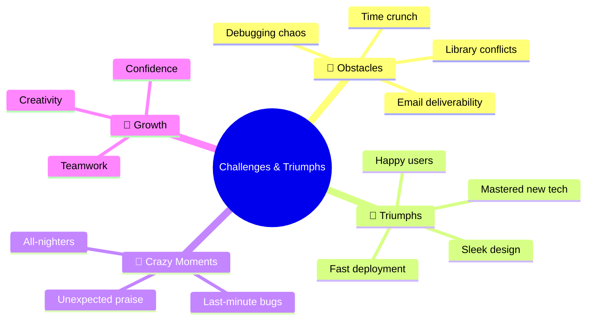

# 🎉 Tendercare Website: From Idea to Impact
_A Journey of Code, Creativity, and Care_

**Presented by:** [Your Name]  
**Date:** [Seminar Date]

---

## 🗺️ Agenda – The Adventure Map
1. The Big Dream
2. The Spark
3. The Toolbox
4. The Blueprint
5. The Art
6. The Magic
7. The Engine
8. The Star Feature
9. The Test Lab
10. The Launch
11. The Obstacles
12. The Treasure
13. The Next Quest
14. The Show
15. Q&A
16. Thank You

---

## 🌟 The Big Dream (Project Overview)
What if healthcare websites were as friendly as your favorite app?  
Tendercare: A digital home for care, trust, and easy booking.

**Mindmap:**

---

## 💡 The Spark – Planning & Research
Every great project starts with a spark!
- Pain points: Outdated site, no online booking, not mobile-friendly.
- Goals: Modern, easy, beautiful, accessible.

**Mindmap:**

---

## 🧰 The Toolbox – Tech Stack
What’s in our toolbox?
- Frontend: HTML, CSS, JS
- Backend: PHP
- Database: SQLite
- Libraries: Bootstrap, AOS, Swiper, GLightbox, PureCounter, PHPMailer

**Tech Stack Showdown:**

---

## 🏗️ The Blueprint – Project Structure
A good house needs a solid blueprint.
- Organized folders: assets, forms, HTML, DB.

_Visual: Schematic folder tree (draw in PowerPoint or use screenshot)_

---

## 🎨 The Art – Design Process
Design is intelligence made visible.
- Wireframes, color palette, logo, mobile-first.

_Visual: Wireframe sketches, palette swatches, logo, font samples_

---

## ✨ The Magic – Frontend Implementation
Where code meets creativity.
- Responsive layouts, smooth animations, interactive forms.

_Visual: Animated GIF of scrolling through homepage, callouts for Bootstrap, AOS, Swiper, etc._

---

## ⚙️ The Engine – Backend Implementation
The invisible engine that powers the experience.
- PHP for forms, SQLite for data, PHPMailer for emails.

**Flowchart:**

---

## 🌈 The Star Feature – Book a Demo
Let’s see the magic in action!
- User fills form → PHP validates → Data saved → Email sent → User notified.

**Crazy Book a Demo Flowchart:**

---

## 🧪 The Test Lab – Testing & Debugging
Breaking things on purpose (so users don’t have to)!
- Cross-browser, mobile, user feedback, bug fixing.

_Visual: Cartoon “mad scientist” or test tubes, mindmap for testing_

---

## 🚀 The Launch – Deployment
Ready for the world!
- Minify, optimize, upload, go live.

_Visual: Rocket launch animation or GIF, flow: Local → Server → World_

---

## 🧱 The Obstacles – Challenges
Every hero faces challenges.
- Library integration, email issues, time crunch, learning curves.

**Challenges & Triumphs Mindmap:**

---

## 💎 The Treasure – Key Learnings
What I gained on this journey.
- Coding, design, project management, user empathy.

_Visual: Treasure chest with “skills” as gems, mindmap for learnings_

---

## 🛣️ The Next Quest – Future Plans
The adventure continues…
- User login, payments, SEO, accessibility, new features.

_Visual: Road ahead or “next level” game screen, mindmap for future_

---

## 🎬 The Show – Live Demo
Let’s see it in action!
- Walkthrough: homepage, about, booking, contact.

_Visual: Live screen share or pre-recorded video, use spotlight/cursor highlights_

---

## 🔥 Q&A – The Campfire
Let’s chat! Any questions?

_Visual: Campfire or chat bubble icons_

---

## 🎊 Thank You – The Celebration
Thank you for joining my journey!
- Contact info, project link, social media.

_Visual: Confetti animation, party emoji, or fireworks_

---

## 🖼️ How to Use This File
- Copy Mermaid code blocks into [mermaid.live](https://mermaid.live/) to export SVG/PNG for PowerPoint.
- Use bold colors, large fonts, and icons for each slide.
- Add animations and transitions for extra flair.
- Insert exported diagrams and mindmaps as images in your slides.

---

**Go impress everyone! 🚀** 